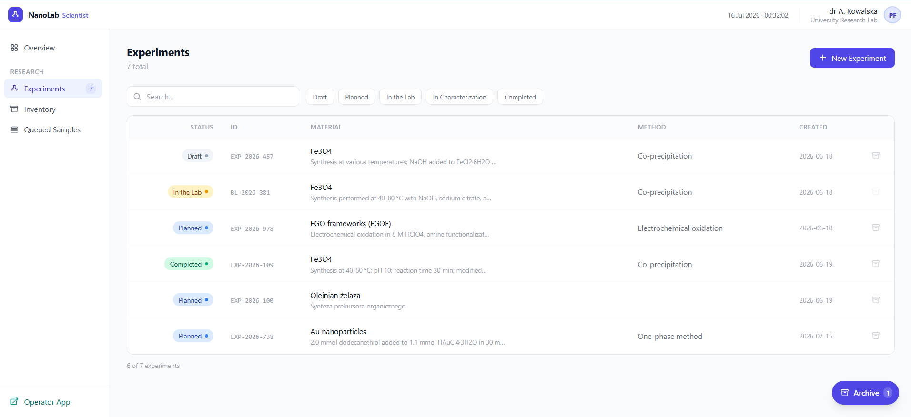
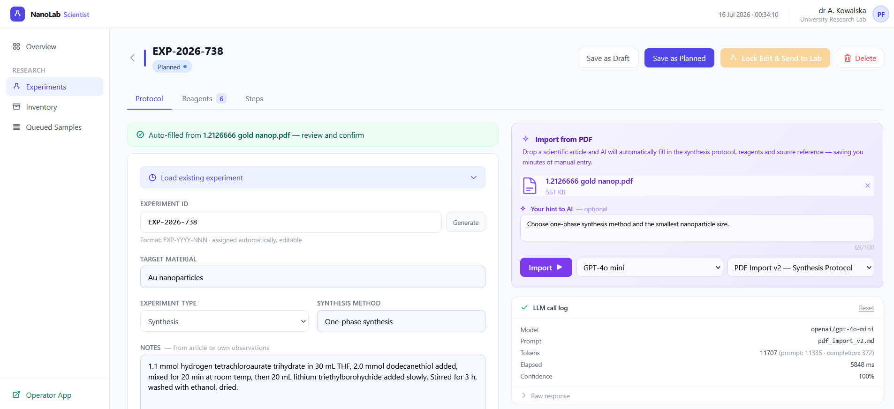
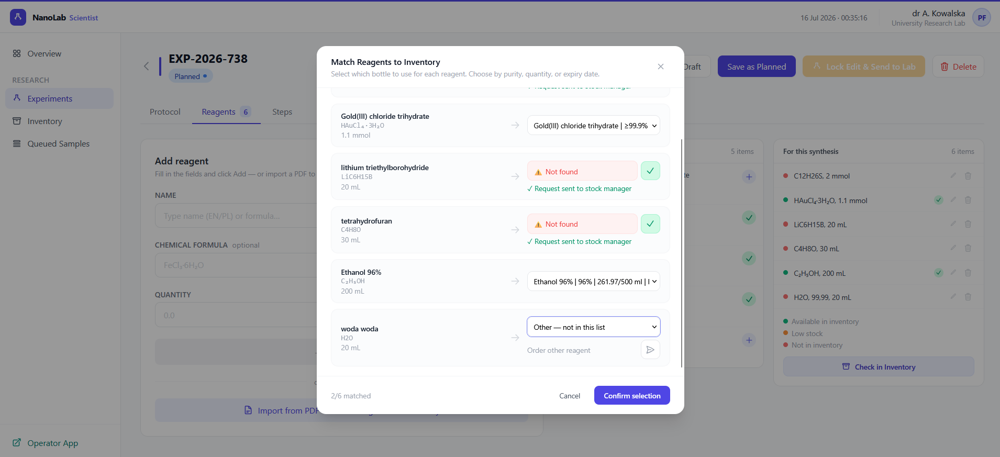
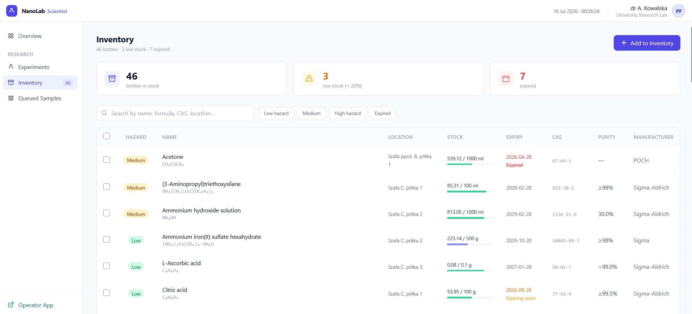
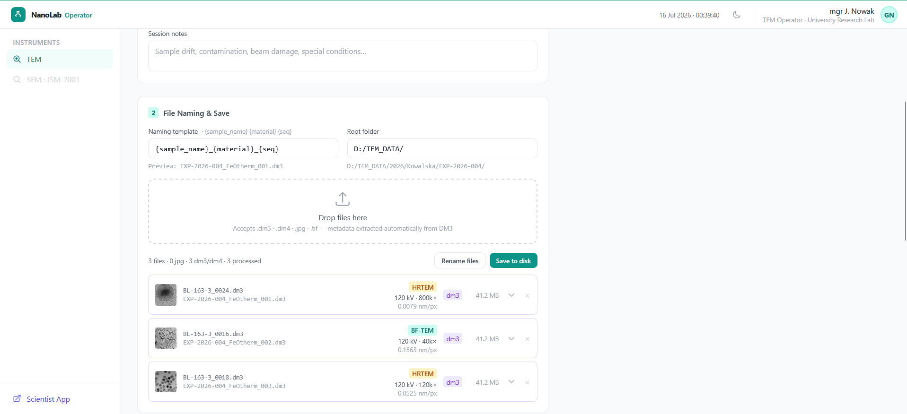
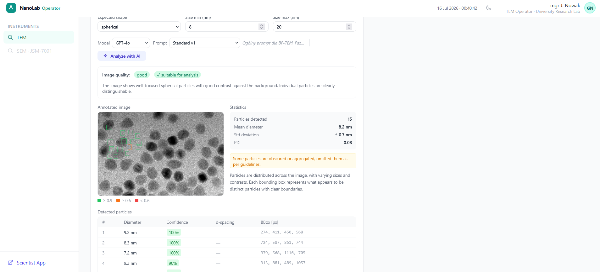

# NanoLab

A lab information management system (LIMS) built for a nanomaterials research lab —
experiment planning, reagent inventory, and a TEM (transmission electron microscopy)
sample workflow from submission through imaging to archiving.

This is a private side project, not affiliated with or endorsed by any employer or
institution. It's inspired by real workflow pain points I encountered while working
as a researcher and TEM operator: paper lab notebooks, reagent tracking in shared
spreadsheets, and microscope session metadata that lived only in file names.

> **Note on data:** all data in this repository is synthetic or anonymized. People,
> institution names, and inventory entries are fictional. No real names, credentials,
> or lab data are included.

---

## Stack

| Layer | Technology |
|---|---|
| Frontend | HTML + Tailwind CSS (CDN) + Alpine.js (CDN) — no build step |
| Backend | FastAPI (Python), JSON files as the data store |
| AI | LLM calls via [OpenRouter](https://openrouter.ai) (raw HTTP, no SDK) |
| Microscopy file parsing | [ncempy](https://github.com/ercius/openNCEM) for Gatan `.dm3`/`.dm4` files |

The frontend is intentionally build-tool-free: every HTML file works standalone,
served directly by FastAPI's `StaticFiles`. No webpack, no npm install, no compile step.

---

## Architecture / design decisions

- **Deterministic code first, AI where it actually pays off.** LLM calls are used
  for two things only: extracting structured data from synthesis PDFs, and
  detecting nanoparticles in TEM images. Everything else — inventory math, workflow
  state, file handling — is plain code.
- **Provenance on every LLM call.** Each call logs the model, prompt file/version,
  elapsed time, and token counts, so results are traceable and reproducible.
- **Confidence surfaced, not hidden.** PDF extraction and particle detection return
  a confidence score; the UI shows a warning below a threshold instead of silently
  trusting the model.
- **Security hardening on LLM endpoints:** a path-traversal bug in the prompt-file
  loader was found and fixed (an attacker-controlled `prompt_file` param could read
  arbitrary server files, including `.env`); prompt injection from PDF/user input is
  mitigated by forcing strict JSON-schema structured output, so the model can't break
  out of the expected response shape.

---

## What works (MVP-01)

**Scientist workflow**
- Experiment planning with a step-by-step synthesis designer (10 action types:
  prepare, add, heat, stir, wait, measure, separate, wash, dry, note)
- PDF import → LLM extracts target material, method, reagents, source metadata into
  the form automatically
- Reagent inventory with CAS/formula/name fuzzy matching against stock bottles
- Full experiment lifecycle: draft → planned → locked-for-synthesis → archived

**TEM operator workflow**
- Kanban board for sample requests (pending → preparation → imaging → archived),
  with guardrails preventing a sample from reaching imaging without required prep data
- Drag-and-drop `.dm3`/`.dm4` upload with automatic metadata extraction (pixel
  calibration, magnification, imaging mode, field of view)
- AI-assisted particle detection on TEM images, with size/shape context input and
  a bounding-box review UI (accept/reject per detection)
- Session archiving with grid box/slot tracking

---

## Screenshots

**Scientist App** — experiment list, AI-assisted PDF import, and reagent/inventory matching:

<p>
  <br>
  <br>
  <br>
  
</p>

**Operator App** — TEM session file handling and AI-assisted particle detection:

<p>
  <br>
  
</p>

More screenshots (full workflow, both apps, light/dark mode) are in [`0_screenshots/`](0_screenshots/).

---

## Running it locally

```bash
cd backend
python -m venv venv
venv\Scripts\activate        # or: source venv/bin/activate on macOS/Linux
pip install -r requirements.txt

copy .env.example .env       # or: cp .env.example .env
# then fill in OPENROUTER_API_KEY / OPENROUTER_API_KEY_VISION

python seed.py                # populates backend/data/*.json with demo records
uvicorn main:app --reload
```

Then open:
- Scientist app: [http://localhost:8000/app/scientist/index.html](http://localhost:8000/app/scientist/index.html)
- Operator app: [http://localhost:8000/app/operator/tem.html](http://localhost:8000/app/operator/tem.html)

The LLM features (PDF import, TEM image analysis) require an
[OpenRouter](https://openrouter.ai) API key; everything else works without one.

---

## Contact

Błażej Leszczyński
[blazej.leszczynski@gmail.com](mailto:blazej.leszczynski@gmail.com) ·
[linkedin.com/in/blazej-leszczynski1](https://www.linkedin.com/in/blazej-leszczynski1)
